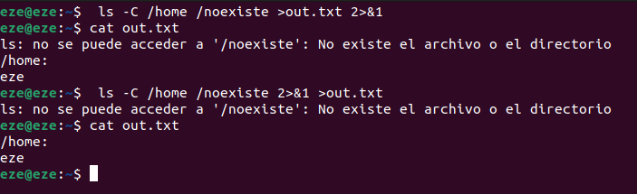
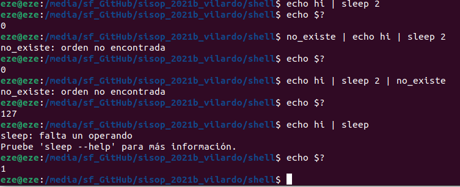
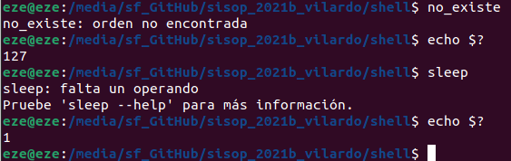
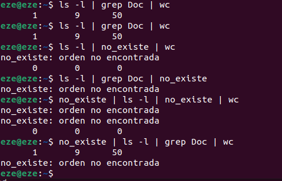
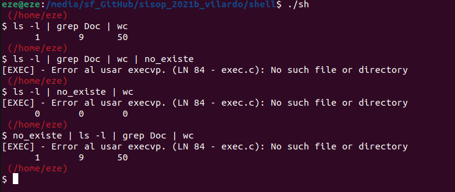
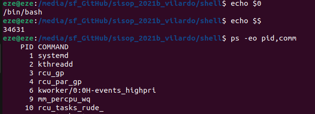
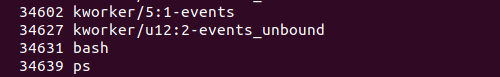
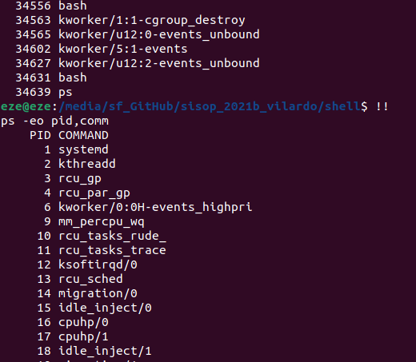

# Lab: shell

### Búsqueda en $PATH
1. ¿Cuáles son las diferencias entre la syscall execve(2) y la familia de wrappers proporcionados por la librería estandar de C (libc) exec(3)?

La diferencia es que la familia de funciones exec(3) son un monton de wrappers por encima de execve que permiten usarla con mas comodidad.
Estas caracteristicas que aporta cada una estan identificadas por letras:

Ej:

L (execl, execlp, execle) -> pueden recibir multiples elementos como un lista de parametros terminada en NULL. (char* arg1, ...., char* argn, NULL)

V (execv, execvp, execvpe) -> Similar a l pero en ves de en una lista en un vector terminado en NULL. (char* const argv[])

E (execle, execvpe) -> En estas tambien se envia un vector pero con las variables de entorno para la nueva ejecucion.

P (execlp, execvp, execvpe) -> Hace innecesario pasar el path, ya que en case que caso que no sea pasado buscaran la direccion del ejecutable.

2. ¿Puede la llamada a exec(3) fallar? ¿Cómo se comporta la implementación de la shell en ese caso?

Por supuesto que puede fallar, por falta de permisos, demasiados bytes en la lista de argumentos o en el environment, alguno de los punteros
pasados estaba fuera de tu memoria accesible, etc etc.

Mi implementacion de shell, al fracasar el exec, libera la estructura creada y hace un exit para evitarse problemas.

---
### Comandos built-in
1- Entre cd y pwd, alguno de los dos se podría implementar sin necesidad de ser built-in? ¿Por qué? ¿Si la respuesta es sí, cuál es el motivo, entonces, de hacerlo como built-in? (para esta última pregunta pensar en los built-in como true y false)

El cd debe ser implementado como un built-in, ya que va a modificar el proceso, en cambio pwd si puede ser implementado sin ser un built-in
ya que no es necesario serlo para poder obtener el path de donde fue llamado.

El motivo de hacerlo es ahorrar los recursos que implicaría lanzar otro proceso más en procesos que se suelen ejecutarse con una frecuencia elevada.

---

### Variables de entorno temporarias
1. ¿Por qué es necesario hacerlo luego de la llamada a fork(2)?

Porque si se hiciera antes, el enviroment original (el de la shell) tambien seria modificado. Al hacerlo luego del fork solo estamos modificando
el enviroment del proceso hijo.

2. En algunos de los wrappers de la familia de funciones de exec(3) (las que finalizan con la letra e), se les puede pasar un tercer argumento (o una lista de argumentos dependiendo del caso), con nuevas variables de entorno para la ejecución de ese proceso. Supongamos, entonces, que en vez de utilizar setenv(3) por cada una de las variables, se guardan en un array y se lo coloca en el tercer argumento de una de las funciones de exec(3).
   ¿El comportamiento resultante es el mismo que en el primer caso? Explicar qué sucede y por qué.
   Describir brevemente (sin implementar) una posible implementación para que el comportamiento sea el mismo.

No tendria el mismo comportamiento. Al usar una de estas funciones el proceso solo tendria acceso a las variables que le pasamos.
Una posible solución seria mandarle todas las variables que teniamos en enviroment + las nuevas variables que queriamos agregarle.

---

### Procesos en segundo plano
1. Detallar cuál es el mecanismo utilizado para implementar procesos en segundo plano.

Ya que el parseo me ahorra los problema de saber si en la linea venia un '&', siendo que si venia el cmd sera de tipo backcmd
o sino execmd, en el caso de que sea backcmd, lo casteo para recuperar el execcmd de su interior y llamo a exec_cmd con el,
por aca todo igual a como si no fuera en segundo plano, lo que cambia es que en runcmd.c si detecto que es del tipo backcmd,
no bloqueo esperando(lo espero pero sin bloquear con el flag WNOHANG, si esta muerto lo agarro sino queda huerfano) y printeo su PID, devolviendo el control de la shell al usuario mientras el proceso sigue en ejecucion.

---

### Flujo estándar
1. Investigar el significado de 2>&1, explicar cómo funciona su forma general y mostrar qué sucede con la salida de cat out.txt en el ejemplo. Luego repetirlo invertiendo el orden de las redirecciones. 

¿Cambió algo?

El 2>&1 indica que, desea cambiar la salida estandar de error (2 -> salida estandar de error, > -> porque cosa la va a cambiar) y el &1 indica
cual seria la nueva salida, si no estuviera el & la salida del canal de error terminaria almacena en un archivo de nombre "1", pero al estar
el '&' se lo toma como un file descriptor.

En el caso (ls -C /home /noexiste >out.txt 2>&1), ¿que esta pasando?
Estamos diciendo que >out.txt, osea que salida estandar va ser el archivo out.txt, y tambien decimos 2>&1, que significa que la salida estandar
de los errores va a ser redireccionado al mismo archivo que la salida estandar.

El resultado:

Al invertirlo, estas diciendo que la salida estandar de los errores se va a redireccionar a la salida estandar, y despues decis
que la salida estandar se va a redireccionar al archivo out.txt, pero la salida de errores va a seguir apuntando a donde estaba direccionada la stdin antes.

---

### Tuberías múltiples (pipes)
1- Investigar qué ocurre con el exit code reportado por la shell si se ejecuta un pipe ¿Cambia en algo? ¿Qué ocurre si, en un pipe, alguno de los comandos falla? Mostrar evidencia (e.g. salidas de terminal) de este comportamiento usando bash. Comparar con la implementación del este lab.

¿Que pasa con los codigos de errores?

Puede verse que al utilizar pipes el "exit status" observado con "echo $?" es siempre el correspondiente al último comando del pipe.
Y puede verse tambien que el codigo de error de estos comandos que fallan es el mismo tanto al ejecutarlos individualmente que al ejecutarlos como últimos eslabones
del pipe.

Ejemplos de comando que falle:

¿Que ocurre?

Tanto en el bash como en mi implementación, si alguno de los comandos falla no produce una falla que finalice la ejecución, solo se pierde la información de los comandos ejecutados anteriormente a este
y los comandos a continuación funcionaran con normalidad.

---

### Pseudo-variables
1. Investigar al menos otras tres variables mágicas estándar, y describir su propósito. Incluir un ejemplo de su uso en bash (u otra terminal similar).

$0: Muestra el nombre del proceso.

$$: Muestra el PID del proceso.

!!: Muestra el comando ejecutado anteriormente y lo vuelve a ejecutar.

Aca su ejecución:

---

